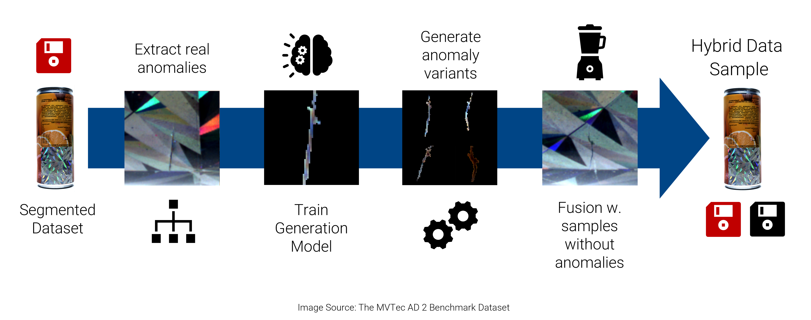

# Hybrid Sample Generation
 [](https://www.gnu.org/licenses/gpl-3.0) [](https://doi.org/10.1109/AMLDS63918.2025.11159383)

This project extracts real anomalies from labelled 2D images or 3D volumes,
trains a generative model, creates multiple synthetic variants and places them
into original control samples. It is based on the IEEE paper
[AMLDS63918.2025.11159383](https://doi.org/10.1109/AMLDS63918.2025.11159383).



## Data model

Study metadata and relationships are stored in `artifacts.sqlite`. NumPy arrays
remain normal files below `artifacts/`; the database stores paths relative to
the study folder.

```text
OriginalSample  1 ── 0..n  RealAnomaly  1 ── 0..n  SyntheticAnomaly
       1                                                      1
       │                                                      │ 
       └──  0..n  HybridSample  1 ── 1..n  Placement  0..n  ──┘
```

A placement is an independent record. It identifies one synthetic anomaly,
one hybrid sample, an insertion order, a matching method and score, and an
explicit normalized center position. Positions use `(y, x)` for 2D and
`(z, y, x)` for 3D. This removes the old one-to-one and filename-based
relationship between anomalies and generated samples.

Database constraints enforce unique component/variant/order combinations and
foreign-key integrity. Original IDs are deterministic hashes of the resolved
absolute `source_image_path`, falling back to `source_name` when no path is
provided. Derived IDs use parent IDs and component, variant or placement-order
indices. Relationships are stored explicitly rather than inferred from artifact
filenames. Changing the source path, or the fallback name, changes its ID.

One study has this layout:

```text
study/
  configuration.json
  artifacts.sqlite
  <study_name>.db                  # Optuna trials and model checkpoint references
  trained_models/
  artifacts/
    original_samples/<id>/{image,segmentation}.npy
    real_anomalies/<id>/{image,segmentation,roi_image,roi_segmentation}.npy
    synthetic_anomalies/<id>/{image,segmentation}.npy
    hybrid_samples/<id>/{image,segmentation}.npy
    placements/<id>/{roi_image,roi_segmentation}.npy
  evaluation_results/
  exports/
```

Files appear as their pipeline phases run. Unannotated originals have no
segmentation artifact; hybrid images and masks are written during materialization.
Placement ROI images and masks are optional backend outputs. Loading a trained
generator requires its Optuna database and the referenced model checkpoint.

## Input

The pipeline accepts channel-first arrays:

- 2D: `(C, H, W)`
- 3D: `(C, D, H, W)`

A single dataloader yields all originals: annotated anomaly sources and normal
controls. Controls use an empty segmentation; unannotated samples may use
`None`. A dataloader may yield the compact tuple
`(image, segmentation, source_name)`.
For unambiguous source identity and provenance, yield `InputSample` records or
implement `iter_input_samples()`:

```python
from synthesizer.InputSample import InputSample

yield InputSample(
    image=image,
    segmentation=mask,
    source_name="sample-001",
    source_image_path="/dataset/images/sample-001.png",
    source_segmentation_path="/dataset/masks/sample-001.png",
)
```

Each `source_name` must be unique within an import, even when samples have
different `source_image_path` values. Resolved source identities must also be
unique. A positive segmentation marks an anomalous original; an empty mask marks
an annotated control, and `None` marks an unannotated control.

An annotated mask must have the same spatial shape as its image and either one
channel or the same channel count as the image. The spatial dimensions in
`config.extraction.anomaly_size` must match the input data; tuple order is
`(C, H, W)` for 2D and `(C, D, H, W)` for 3D.

The bundled image, NIfTI and MVTec AD 2 loaders expose this typed boundary.
`ingest_dataset()` validates, classifies and snapshots the complete supplied
dataset on each call, replacing the previous input catalog and derived records.
All later phases select their inputs from the repository and never iterate the
original dataloader again.

## Requirements and installation

The pipeline uses PyTorch, Optuna, NumPy, SciPy, pandas, scikit-image and
Matplotlib. Additional model and file-format dependencies are listed in
`requirements.txt`.

Install PyTorch in the variant appropriate for the local CPU/CUDA environment,
then install the repository dependencies:

```bash
python -m pip install -r requirements.txt
```

Exact PyTorch and CUDA versions depend on the target system. A GPU is useful for
training but the orchestration and repository layers do not require one.

## Usage

```python
from synthesizer.Configuration import Configuration
from synthesizer.Evaluation import evaluate_study
from synthesizer.HybridDataGenerator import HybridDataGenerator
from data_handler.Visualizer import run_hybrid_visualizer

config = Configuration(
    "study-01",
    "cVAE_ConvNeXt_2D",
    anomaly_size=(1, 32, 32),
    study_folder="results/study-01",
)

config.generation.variants_per_real_anomaly = 5
config.matching.hybrids_per_original = 3
config.matching.anomalies_per_hybrid = 2
config.matching.reuse_synthetic_across_hybrids = True
config.matching.allow_sibling_variants_in_same_hybrid = False
config.matching.routine = "local"

generator = HybridDataGenerator(config)
summary = generator.ingest_dataset(all_samples_dataloader)
generator.extract_anomalies()
generator.train_generator(no_of_trials=5)
generator.generate_synthetic_anomalies()

# Planning writes HybridSample/Placement records and updates the matching cache.
generator.plan_hybrid_samples()

# Fusion consumes the stored plan and writes generated payloads.
generator.materialize_hybrid_samples()

hybrid_dataset = generator.datasets.hybrid_samples(
    load_to_ram=False,
    numpy_mode=True,
)
evaluation = evaluate_study(config)
config.save_config_file()
run_hybrid_visualizer(config)
```

The ingest is the only phase that accepts the source dataloader. Extraction,
fusion-backend training and planning select anomalous or normal originals by
database fields. Repository-backed phases need no load step. A new
`HybridDataGenerator(config)` can immediately continue from persisted records.
Only the generator model has to be loaded explicitly before producing new
variants, because it is an in-memory runtime component. A fusion backend is
created on demand and loads `config.fusion.checkpoint` when one is configured.
Save the configuration before opening the visualizer: its configuration view
reads the saved JSON, and the GUI call blocks until the window closes.

### Continuing a study and repeating phases

For a study with synthetic variants and a saved hybrid plan, continue directly
with materialization:

```python
from synthesizer.Configuration import load_config_file
from synthesizer.HybridDataGenerator import HybridDataGenerator

config = load_config_file("results/study-01/configuration.json")
generator = HybridDataGenerator(config)
generator.materialize_hybrid_samples()
```

To build a new plan from existing synthetic variants, call
`generator.plan_hybrid_samples()` before materialization. To regenerate synthetic
variants with a saved generator, call `generator.load_generator(trial_id=-1)`
followed by `generator.generate_synthetic_anomalies()`; `-1` selects the best
Optuna trial, `-2` the newest trial, and a nonnegative number a specific trial.

Repeating a phase has the following effects:

| Phase | Effect on existing results |
|---|---|
| `ingest_dataset()` | Replaces all originals and removes real/synthetic anomalies, hybrids, placements and matching-cache entries. |
| `extract_anomalies()` | Replaces real anomalies and removes synthetic anomalies, hybrids, placements and matching-cache entries. |
| `generate_synthetic_anomalies()` | Replaces synthetic variants and removes hybrids and placements; the real-ROI matching cache remains available. |
| `plan_hybrid_samples()` | Replaces all hybrid and placement records, including generated statuses and their artifact references; retains and updates the matching cache. |
| `materialize_hybrid_samples()` | Processes every stored hybrid, including already generated or failed ones, and rewrites its generated outputs. |

These resets remove database records; old array files can remain on disk without
repository references. Repeating a phase is not an incremental append or an
automatic skip of completed work. After changing generated data, rerun evaluation
to replace its previous CSV results.

## Configuration

`Configuration` contains requested behavior only. Generated entities, matching
results and extraction metadata live in the study repository.

```text
config.study        identity, location, reproducibility seed
config.extraction   cutout, normalization and ROI rules
config.augmentation target-mask and training augmentation
config.generation   model sampling, feedback and variant count
config.matching     hybrid count, placement count and reuse policies
config.training     optimizer and dataloader behavior
config.evaluation   metric/outlier settings
config.model        generator choice and model-specific parameters
config.fusion       fusion backend and backend-specific parameters
```

The current configuration schema is version 5 and the artifact database schema
is version 2. Older study databases and filename/CSV layouts are intentionally
unsupported; recreate the study and run `ingest_dataset()` again.

`config.matching.seed` initially copies `config.study.seed`, but the two fields
are independent afterward. Set both explicitly when changing the study and
matching seeds together:

```python
config.study.seed = 123
config.matching.seed = 123
```

### Extraction

Extraction finds connected components in the positive segmentation, crops each
component, downscales it only when it exceeds the configured target size, and
center-pads it to `config.extraction.anomaly_size`. The original ROI, mask,
normalized source center, scale factors and normalization metadata are retained
with the resulting `RealAnomaly` record.

The principal settings are:

- `config.extraction.separate_components`: extract connected components as
  separate real anomalies. When disabled, the positive mask is handled as one
  region.
- `config.extraction.min_coverage_ratio`: discard components smaller than this
  fraction of the target spatial cutout area/volume. The default is `0.05`.
- `config.extraction.add_background_noise`: add a small noise floor to otherwise
  constant cutout background.
- `config.extraction.normalization`: `"z-score"` (mean/std),
  `"zscore_median"` (median/MAD), or `None`.
- `config.extraction.roi.fixed_size`: fixed spatial ROI size, or `None` for a
  dynamic ROI.
- `config.extraction.roi.min_padding` and `padding_ratio`: for a dynamic ROI,
  its size on each axis is the anomaly extent plus the larger of the absolute
  padding and proportional padding.
- `config.extraction.roi.min_size`: scalar or per-axis lower bound for a dynamic
  ROI.

ROI tuples contain spatial axes only: `(H, W)` for 2D and `(D, H, W)` for 3D.

### Fusion parameters

`config.fusion.parameters` is the selected backend's parameter dataclass.
Configure its fields directly; the former `set_fusion_params(...)` wrapper is
removed:

```python
config.fusion.set_backend("classical")  # default: classical backend / others are experimental

config.fusion.parameters.sq = 0.1
config.fusion.parameters.steepness_factor = 5.0
config.fusion.parameters.upsampling_factor = 2
config.fusion.parameters.dilation_size = 1
config.fusion.parameters.shave_pixels = 0
config.fusion.parameters.max_alpha = 0.9  # default: classical backend
config.fusion.parameters.fusion_variation = False

config.validate()
```

The registry creates the matching dataclass and validates parameter types,
ranges and backend compatibility. Validation also runs when saving/loading a
configuration and creating a backend. JSON stores backend parameters directly
under `fusion.parameters`; unknown parameter names are rejected.

The classical backend crops the generated anomaly to its target mask, restores
its saved extraction scale, matches its intensity to the target context and
alpha-blends it at the planned normalized center. It returns the fused image, a
label mask in control coordinates and optional placement ROI artifacts. Multiple
placements are materialized in their stored order and their label masks are
combined.

Important classical parameters include:

- `max_alpha`, `sq`, `steepness_factor` and `upsampling_factor`, which control
  the maximum anomaly contribution and the distance-transform alpha falloff.
- `fusion_use_sobel_for_alpha_mask`, `sobel_threshold`, `dilation_size` and
  `shave_pixels`, which enable and tune the optional edge-refined alpha path.
- `fusion_variation` plus `alpha_variation`, `sq_variation`,
  `steepness_variation` and `selected_confidence`, which sample blending
  parameters per placement.
- `fusion_normalization_border_width`: `None` disables fusion-time intensity
  normalization, `-1` uses the whole control, `0` uses the available fallback
  context, and a positive value uses a local ring around the target mask.
- `fusion_restore_anomaly_bg_relation`, `fusion_relation_mode`,
  `fusion_relation_norm_classes_separately` and
  `fusion_relation_min_context_size`, which control whether the original
  anomaly/context relation is restored and how multiclass context is estimated.
- `fusion_keep_bg`, `fusion_bg_value`, `fusion_relative_bg_threshold` and
  `fusion_bg_exterior_only`, which can preserve detected control-background
  pixels unchanged.

Local normalization uses robust median/IQR context statistics. Relation mode
`delta` preserves the original median difference; `ratio` preserves the median
ratio and is intended for strictly positive intensities away from zero. If a
local or class-specific ring contains too few values, the backend falls back to
available target-mask-outside context; if that is still insufficient, the scope
is left unnormalized.

### Synthetic variants

`config.generation.variants_per_real_anomaly` controls how many children are
generated for every `RealAnomaly`. Each child has its own deterministic ID,
variant index, seed, image and target mask. Feedback generation is bounded by
`config.generation.feedback.max_attempts`.

### Hybrid planning

- `hybrids_per_original`: requested number of hybrid variants per eligible
  target original.
- `anomalies_per_hybrid`: target placement count in each hybrid.
- `max_anomalies_per_hybrid_deviation`: deterministic random deviation around
  the placement count.
- `reuse_synthetic_across_hybrids`: whether the same synthetic ID may be used
  by more than one hybrid.
- `allow_sibling_variants_in_same_hybrid`: whether variants with the same real
  parent may occur together in one hybrid.
- `intensity_weight` and `gradient_weight`: weights for template matching.
- `seed`: reproducibility seed owned by the matching phase.

`local`, `global`, `batchwise` and `fixed_from_extraction_control_fusion` target
originals with `has_anomaly=False`. `fixed_from_extraction_anomaly_fusion` targets
anomalous originals. Only real anomalies with synthetic variants are candidates.
A hybrid can contain fewer placements than requested; if no eligible placement
is found, that hybrid is omitted entirely.

`local` assigns real anomaly ROIs sequentially across hybrids and controls.
It searches the full control image only for the next ROI with an eligible
synthetic variant, trying another ROI if the match is invalid or overlaps an
existing placement. Matching stops as soon as the requested placement count is
reached. Each hybrid tries at most one pass through the ROI pool; unused ROIs
are not loaded or matched. The ROI sequence restarts on each planning run.

`global` evaluates all real anomaly ROIs for each control and selects placements
in descending match-score order. `batchwise` evaluates and ranks only a seeded
subset of at most `batch_size` ROIs per control.

All three modes prepare control and ROI gradients on demand and reuse them
within the planning run. Pair results, including rejected pairs, are cached in
SQLite by matcher signature. Repeated planning with unchanged inputs and weights
reuses evaluated pairs, including when changing modes; new pairs are computed
only as needed. `fixed_from_extraction_control_fusion` reuses source centers on
arbitrary controls;
`fixed_from_extraction_anomaly_fusion` joins originals and real anomalies by
foreign key and places variants back at their extraction positions.

## Datasets, evaluation and visualization

`StudyDatasets` creates short-lived `OriginalSampleDataset`,
`RealAnomalyDataset`, `SyntheticAnomalyDataset` and `HybridSampleDataset` views
over repository records. Original views can filter `has_anomaly` and
`is_annotated`. They do not scan folders or align files by basename. Dataset
objects are not persistent state of `HybridDataGenerator`; callers choose
explicitly whether a view should load arrays into RAM.

Evaluation joins each synthetic anomaly to its real parent through
`real_anomaly_id`. Placement ROI comparisons use the full
Original → Hybrid → Placement → Synthetic → Real join. The CSV output contains
all relevant IDs, so multiple variants cannot overwrite or masquerade as one
pair.

`evaluate_study(config)` compares each explicit real/synthetic cutout pair using
GLCM contrast, homogeneity, energy and correlation, plus mask volume and center
of mass. GLCMs quantize each channel to 32 levels and aggregate immediate-neighbor
pairs over four 2D or thirteen 3D directions. When placement ROI artifacts are
available, the same GLCM features are also compared between the original real
ROI and the fused placement ROI.

For every metric the evaluator records the absolute pair difference. Outliers
default to the `1.5 * IQR` rule and can be overridden per metric with
`config.evaluation.outlier_thresholds`. Each run replaces
`evaluation_results/metric_diffs.csv`, writes up to three histogram images
(cutout texture, cutout morphology and placement-ROI texture), prints real and
synthetic means, and summarizes outlier overlaps.

`run_hybrid_visualizer(config)` opens a repository-backed study browser with
six views: study overview, datasource originals, real/synthetic anomaly variants,
hybrid samples and their placements, metric-based evaluation, and the complete
normalized data structure. The Datasource tab lists all ingested originals with
source-name/ID search and filters for anomalous/control and annotated/unannotated
samples. Images use automatic RGB display for three-channel arrays; channel,
slice, contrast and mask overlays remain selectable for grayscale and 3D data.
In every image view, use the mouse wheel to zoom around the pointer and drag with
the left mouse button to pan. Double-click a panel or use **Reset zoom** to fit
images again. Zoom persists across contrast, channel, mask and slice changes;
selecting another sample resets it. Use Shift+wheel, the slice slider, or Up/Down
keys to navigate 3D slices.
The Evaluation tab also previews linked fused placement ROIs for cutout metrics.
Use **Placement ROI preview** to choose among multiple placements of the same
synthetic anomaly; available ROI files are preferred initially. Placement metrics
always show their evaluated placement, and selecting a preview leaves the metrics
and evaluation scope unchanged.
Artifacts are loaded lazily and cached only while they are inspected. The data
structure view can preview dependent records before moving their files into a
recoverable `.trash` folder and removing the corresponding database records.

`evaluate_study(config)` reads the same normalized relations without
constructing a generation orchestrator. The visualizer can also be started for
an existing study folder:

```bash
python -m data_handler.Visualizer /path/to/study --channel auto
```

## Tests

```bash
python -m unittest discover -s tests -v
```

The integration tests cover the one-time mixed dataset ingest, multiple real
components, multiple synthetic and hybrid variants, normalized multi-placement
records, unique artifacts, foreign-key traversal, 2D/3D coordinates,
materialization, FK-based evaluation and cached full-image `local` matching.

## Project structure

- `synthesizer/HybridDataGenerator.py` — pipeline orchestration and persisted
  phase transitions
- `synthesizer/Configuration.py` and `synthesizer/configuration/` — validated,
  section-based configuration
- `synthesizer/StudyRepository.py` and `synthesizer/ArtifactStore.py` — normalized
  metadata and NumPy artifact persistence
- `synthesizer/functions_2D/` and `synthesizer/functions_3D/` — anomaly extraction
- `synthesizer/Matching.py` — cached matching and hybrid planning
- `generation_models/` — registered VAE, conditional VAE and diffusion backends
- `fusion_backend/` — classical and trainable fusion backends
- `synthesizer/Evaluation.py` — pairwise metrics, outliers and reports
- `data_handler/visualizer/` — repository-backed study browser and maintenance UI
- `use_cases/` — 2D image, 3D NIfTI and MVTec AD 2 examples

## Cite this work

```bibtex
@INPROCEEDINGS{11159383,
  author={Pfleiderer, Adrian and Bauer, Bernhard},
  booktitle={2025 International Conference on Advanced Machine Learning and Data Science (AMLDS)},
  title={Fused Hybrid Training Samples through Synthetic Anomaly Generation for Optimized Model Training},
  year={2025},
  pages={248-256},
  doi={10.1109/AMLDS63918.2025.11159383}
}
```

## License

This project is licensed under the GNU General Public License v3.0. See
`LICENSE` for the complete terms.
